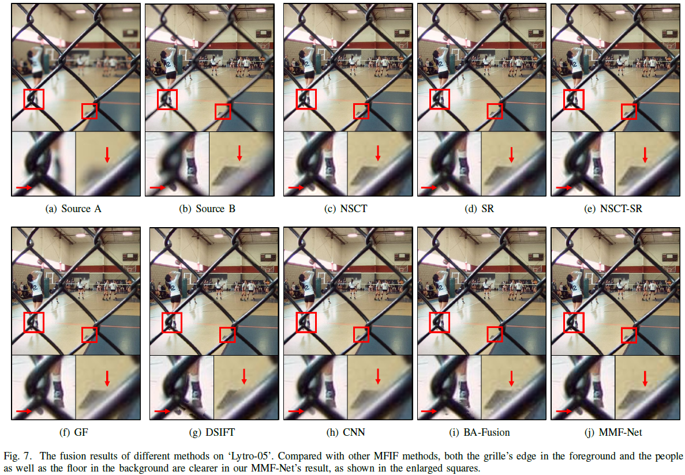
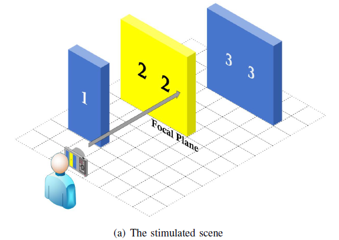
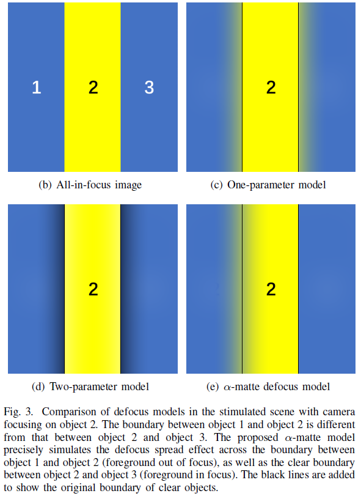
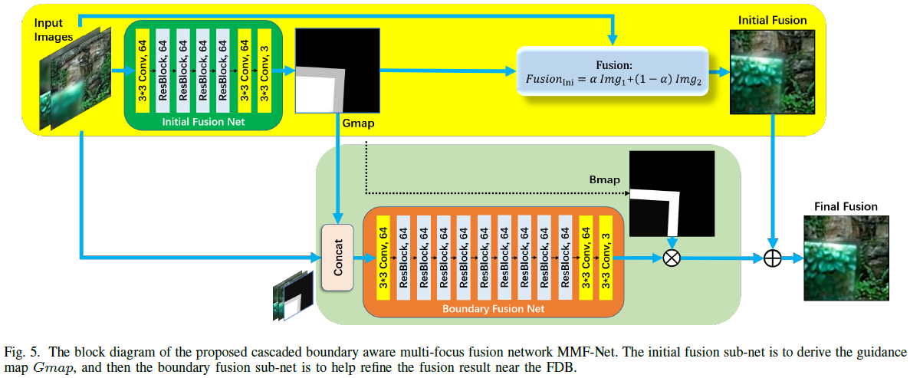
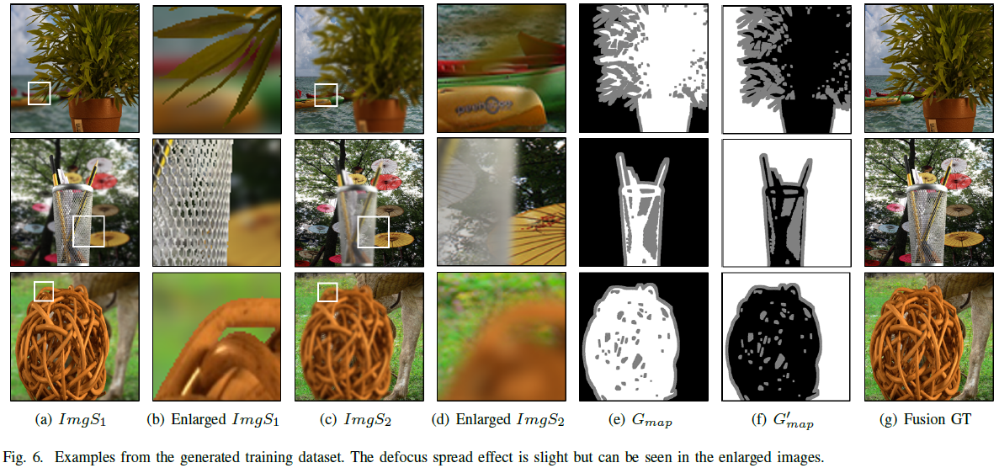

# MMF-Net-alpha-Matte-Boundary-Defocus-Model-Fusion
Code for our papaer An α-Matte Boundary Defocus Model Based Cascaded Network for Multi-focus Image Fusion
https://arxiv.org/abs/1910.13136

Overview
----
Capturing an all-in-focus image with a single camera is difficult since the depth of field of the camera is usually limited. An alternative method to obtain the all-in-focus image is to fuse several images focusing at different depths. However, existing multi-focus image fusion methods cannot obtain clear results for areas near the focused/defocused boundary (FDB). In this paper, a novel α-matte boundary defocus model is proposed to generate realistic training data with the defocus spread effect precisely modeled, especially for areas near the FDB. Based on this α-matte defocus model and the generated data, a cascaded boundary aware convolutional network termed MMF-Net is proposed and trained, aiming to achieve clearer fusion results around the FDB. More specifically, the MMF-Net consists of two cascaded sub-nets for initial fusion and boundary fusion, respectively; these two sub-nets are designed to first obtain a guidance map of FDB and then refine the fusion near the FDB. Experiments demonstrate that with the help of the new α-matte boundary defocus model, the proposed MMF-Net outperforms the state-of-the-art methods both qualitatively and quantitatively.

α-Matte Boundary Defocus Model
----
To see the details of the imaging process of the proposed α-matte boundary defocus model, please reference our paper on arXiv, https://arxiv.org/abs/1910.13136. Here, we only show the difference of several defocus model on the simulated scene.

Network Architecture
----

Dataset
----
There are several examples of the traning dataset generated according to the α-Matte Defocus Model.

Training
----
run main.py

Notice: We run the training process on 4 Nvidia 1080Ti GPUs, if you want to use less GPU, the batch size should be changed.

And the training are conducted with generated dataset (2 source images and 1 guidance map). The data generation method will be released on another project very soon.

Testing
----
run run_inference.py

Currently, the code can be directly used for the tseting on Lytro dataset. Please change the directory if you want to run the test on your own image pairs. Two source images should be named xxxA.jpg/png/bmp and xxxB.jpg/png/bmp in pair and put into the same directory.

A single GPU is enough to carry out it.

Pre-trained models & Results
----

You are very welcome to conduct results comparison with our method. The fusion results on Lytro dataset are shown in ./ResultsLytro.
Unfortunately, a part of the training data comes from the Adobe Alpha Matting Dataset, which is not on public. But we are very happy to help you testing on your data. Please feel free to contact Haoyu Ma via hy-ma17@mails.tsinghua.edu.cn. (Before July 2020; then I will update my email address.)

Besides, if the Lytro Dataset is used in your research, you would include the original paper as your reference. http://www.irisa.fr/temics/demos/lightField/index.html

Acknowledgement
----
Our model is trained on generated dataset, and some of the original images come from the Adobe Alpha Matting and Microsoft COCO datasets.

Citation
----
    @misc{ma2019matte,
        title={An α-Matte Boundary Defocus Model Based Cascaded Network for Multi-focus Image Fusion},
        author={Haoyu Ma and Qingmin Liao and Juncheng Zhang and Shaojun Liu and Jing-Hao Xue},
        year={2019},
        eprint={1910.13136},
        archivePrefix={arXiv},
        primaryClass={cs.CV}
    }
